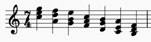
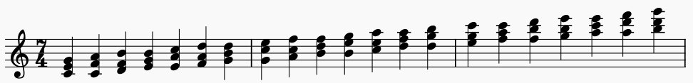
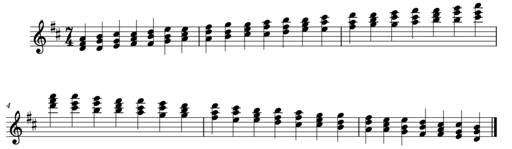
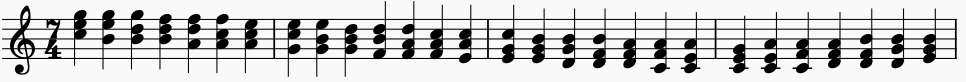
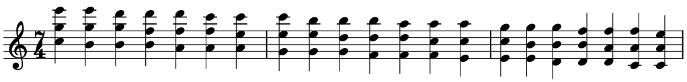

# Chord Scale/Cycle Generator
This is a tool for generate different chord scale sequences that can be used for study/practice. The idea came about after completing Chris Buono's TrueFire Course for ["Triad Chord Scales"](https://truefire.com/guitar-gym/triad-chord-scales-major/c753). I quite liked the concept but didn't want to have to manually write out the different chord scales for each different key so I wrote a piece of software to automate the task. On the way I also expanded it to support drop 2 triads (know as "spread triads" in some circles) as well as support for other scale types (like harmonic minor or melodic minor). Code is also included to enforce the range conditions for particular string sets. This makes it so only one voicing for each chord will appear in the cycle and you won't get any voicing being an octave higher/lower than any other (similar to what Chris does in his course). The range restrictions don't need to be used if you don't want and theoretically could be adapted for any other instrument (stringed or not).

The output files are MusicXML so you need something like MuseScore to read them.

# Theory
So how does this work? All the software really does is repeatedly apply a series of voice leading patterns to produce different types of chord progressions. These progressions are classified by the root motion between successive chords. In a cycle 2 progression the root motion occurs in seconds. In a cycle 4 progression the root motion occurs in 5ths. You can have cycle 2, 3, 4, 5, 6, or 7 progressions (as those are all the basic distances for the intervals). 

The interesting part comes in analyzing the common chord tones between successive chords as summarized in the following table.

* Cycles 2,7: No common tones
* Cycles 4,5: One common tone
* Cycles 3,6: Two common tones

In order to spice things up with how cycle 2 progressions might normally occur (i.e. all the chords in root position) the voiceleading has the chords decreasing in pitch.

So here's an example of a cycle 4 progression in D major:

It's worth pointing out that each of the cycle pairs whose intervals are inversions of each other create the same progression in reverse. Below is a cycle 4/5 pair in D Major.

Each cycle has a voice leading pattern which it follows. Lets take the cycle 4 progession above as an example. If you take a closer look the pattern is the following:

 1. Bottom note is held, top and bottom voices move up one scale degree
 2. Middle note is held, top and bottom voices move up one scale degree
 3. Top note is held, middle and bottom voices move up one scale degree
 4. Start the pattern back at the beginning
 
Similarly we can derive a pattern for cycle 3 progressions.

1. Bottom note moves down one scale degree
2. Middle note moves down one scale degree
3. Top note moves down one scale degree

Could we also apply the same idea to a drop 2 chord? Why not?

1. Bottom note moves down one scale degree
2. Top note moves down one scale degree
3. Middle note moves down one scale degree

So what can we really extract here in terms of what's going on in the larger picture? How were we able to generalize the pattern derived from closed voicings to drop 2? This is all
possible becasue what we're exploiting is that all a scale is doing is defining a relative ordering of the pitches. Where the note is actually placed in the chord voicing is largely
irrelevant in a way. What's more important is where it lies in the scale as this ultimately defines it's function in the initial chord as well as what function will have in the 
subsequent chord after moving the pre-defined number of scale degrees.

This idea could be applied to any chord type if you wanted. A pattern could easily be derived or created for generating the successive sus4 chords. More arbitraily however any harmonic
structure could be used, and even non-harmonic structures as you're not limited in how you define the patterns at all. It would even be possible to change the scale type to something
more exotic like one of the symmetric diminished scales if you wanted to explore different harmonizations rooted in it.

This could easily be expanded to 7th chords (something I plan to take a look at) as well as more exotic scales (i.e. octotonic). The basis for this is the relative ordering of the scale tones to each other and how you move each note throughout the scale so the the possibilities are quite vast if you're look for ways to systematically generate different harmonizations of an arbitrary scale. For instance you could change the starting structure and voice leading patterns to generate sus2 chords instead of triads. In fact any harmonic structure you wanted could be used. The tool could be applied in a similar way to how Slonimsky devised all the different ways to divide up an octave in his "Thesaurus Of Scales and Melodic Patterns". The difference is here you're dealing with voice leading patterns for each note in a harmonic structure as applied to an arbitrary scale. I haven't taken it that far yet as I want to get the more common cases done first, but it's all there if you're feeling adventurous.

# Examples
I've included some examples in the "\Examples" directory to help illustrate things. The code to generate these can be found in tests.py in the "generate_examples()" function as well as any of the other functions which start with "generate". The basic examples are the following:

* Example 1 - Cycle 2/7 in C Major
* Example 2 - Cycle 4/5 in D Major
* Example 3 - Cycle 3/6 in A Harmonic Minor
* Example 4 - Cycle 3/6 in C Major - Drop 2 voicings

The other examples are a full set of of all the different string sets/chord voicings/cycle types in C Major.
