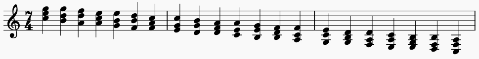
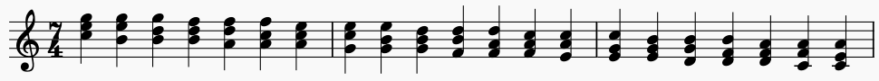

# Chord Scale/Cycle Generator
This is a tool for generate different chord scale sequences that can be used for study/practice. It supports and has been tested for closed/drop 2 triads derived from major scales as well as the three different minor scales (i.e. natural, harmonic, minor). 

Code is also included to enforce the range conditions based on arbitary ranges or pre-defined string ranges. This makes it so only one voicing for each chord will appear in the cycle and you won't get any voicing being an octave higher/lower than any other. The range restrictions aren't mandatory and theoretically could be adapted for any other instrument (stringed or not) beyond the guitar as they're currently written for.

Output files are MusicXML so you need something like MuseScore to read them.

# Theory
So how does this work? All the software really does is repeatedly apply a series of voice leading patterns to produce different types of chord progressions. The default progressions are classified by the root motion between successive chords (but could be expanded to any set of criteria if desired). In a cycle 2 progression the root motion occurs in seconds. In a cycle 4 progression the root motion occurs in 5ths. You can have cycle 2, 3, 4, 5, 6, or 7 progressions (as those are all the basic distances for the intervals).

Below we have an example of each. It is worth noting that each of the different cycles has a reverse corresponding to the inversion of the interval describing the root motion. The cycle 2/7 pair below doesn't align exactly as they were transposed by an octave to make them easier to read.

### Cycle 2

### Cycle 7

### Cycle 4

### Cycle 5

### Cycle 3

### Cycle 6

If you analyze the common chord tones between sucessive chords in the cycles you get the following observations.

* Cycles 2 and 7: No common tones
* Cycles 4 and 5: One common tone
* Cycles 3 and 6: Two common tones

## Voice Leading Patterns
So what are the voice leading patterns I referenced earlier? Taking a closer look at the progressions you'll notice they each have a pattern of three steps which repeats to generate the different chords.

### Cycle 2
1. Top and middle notes move down one scale degree, bottom note moves down two scale degrees
2. Top and bottom voices move down one scale degree, middle voice moves down two scale degrees
3. Middle and bottom note move down one scale degree, top voice moves down two scale degrees

### Cycle 7
1. Middle and bottom voices move up one scale degree, top voice moves up two scale degrees
2. Top and bottom voices move up one scale degree, middle voice moves up two scale degrees
3. Top and middle voices move up one scale degree, bottom moves up two scale degrees

### Cycle 4
1. Bottom note is held, top and bottom voices move up one scale degree
2. Middle note is held, top and bottom voices move up one scale degree
3. Top note is held, middle and bottom voices move up one scale degree

### Cycle 5
1. Top note is held, middle and bottom voices move down one scale degree
2. Middle note is held, top and bottom voices move down one scale degree
3.	Bottom note is held, top and middle voices move down one scale degree

### Cycle 3
1. Bottom note moves down one scale degree
2. Middle note moves down one scale degree
3. Top note moves down one scale degree

### Cycle 6
1. Top note moves up one scale degree
2. Middle note moves up one scale degree
3. Bottom note moves up one scale degree

### Cycle 3 Drop 2
Could we also apply the same idea starting with a drop 2 chord? Why not?

1. Bottom note moves down one scale degree
2. Top note moves down one scale degree
3. Middle note moves down one scale degree

So what can we really extract here in terms of what's going on in the larger picture? How were we able to generalize the pattern derived from closed voicings to drop 2? This is all possible becasue what we're exploiting is that all a scale is doing is defining a relative ordering of the pitches. Where the note is actually placed in the chord voicing is largely irrelevant in a way. What's more important is where it lies in the scale as this ultimately defines its function in the initial chord as well as what function will have in the subsequent chord after moving the pre-defined number of scale degrees.

If you compare the pattern derived from the cycle 3 to that of the cyce 3 drop 2 it should help illustrate this. The only difference between the two is that the middle note has become the top note. However, it still maintains its starting function as the 3rd of the chord.

### Larger Picture
This idea could be applied to any chord type if you wanted. A pattern could easily be derived or created for generating the successive sus4 chords or 4-note 7th chords to produce their diatonic harmonizations. More arbitraily however any harmonic structure could be used and even non-harmonic structures. You're not limited to pre-defined/more common chord voicings in how you define the patterns. It would even be possible to change the scale type to something more exotic like one of the symmetric diminished scales if you wanted to explore different harmonizations rooted in it. 

The core crux of the idea is that you have an ordered repeating set of notes (i.e. scale) from which you define a starting set of pitches (i.e. chord). The order of notes is then used to generate the voice movement between sucessive pitch groupings beginning at the starting set. Unfortunately I haven't taken it that far yet as I want to get the more common cases done first, but it's all there if you're feeling adventurous.

## Enforcing Range Conditions/String Sets
If you take a look at cycle 2 and cycle 7 progressions from before, you'll notice that they might be rather difficult to play. I've included code which will checks a cycle to make sure all the chords in the cycle are unique from the stand point of not being octave transpositions of each other. This makes the cycles far more useful as practice tools. Here's the same cycles played back to back as a pair and confined to the three highest strings of the guitar.

# Examples
More diverse examples can be found in the "\Examples" directory to help illustrate things. The code to generate these can be found in tests.py in the "generate_examples()" function as well as any of the other functions which start with "generate". The basic examples are the following:

* Example 1 - Cycle 2/7 in C Major
* Example 2 - Cycle 4/5 in D Major
* Example 3 - Cycle 3/6 in A Harmonic Minor
* Example 4 - Cycle 3/6 in C Major - Drop 2 voicings

The other examples are a full set of of all the different string sets/chord voicings/cycle types in C Major.

# Inspriation
The idea came about after completing Chris Buono's TrueFire Course for ["Triad Chord Scales"](https://truefire.com/guitar-gym/triad-chord-scales-major/c753). I quite liked the concept but didn't want to have to manually write out the different chord scales for each different key and string set so I wrote a piece of software to automate the task for me. Along the way I also expanded it to support drop 2 triads (know as "spread triads" in some circles) as well as support for other scale types (like harmonic minor or melodic minor). This software could be used to supplement the different exercises in his course so you could cover all the string sets and scale types you could think of.
